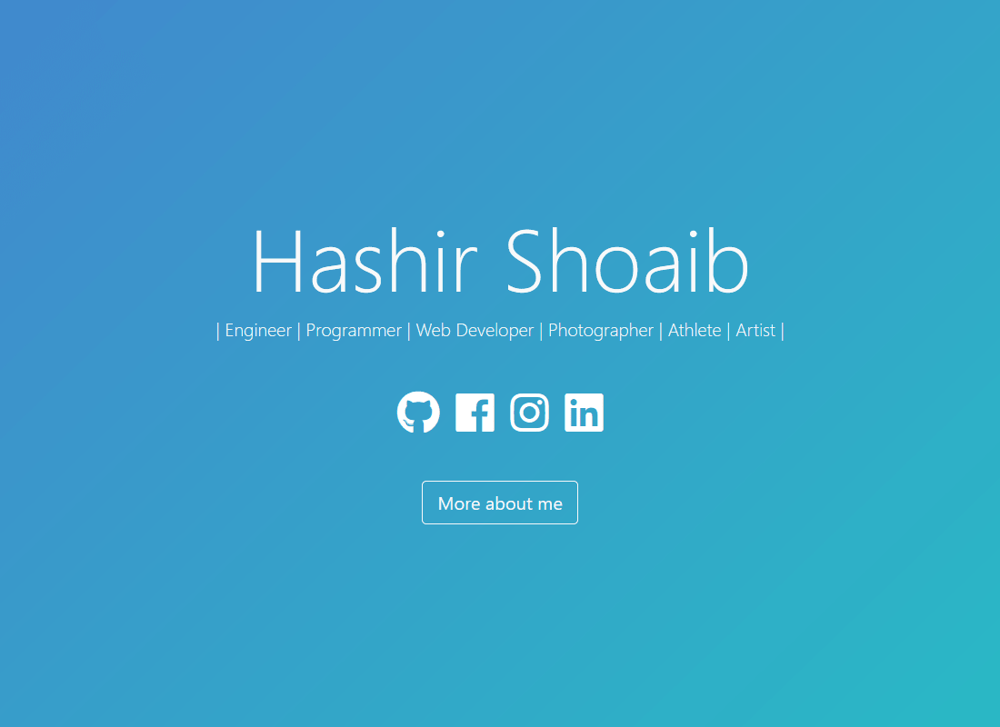

 

  <h1 align="center">Amirhesam Salimnia's Personal Website</h1>
  

    It is a personal static website/portfolio of Amirhesam Salimnia, hosted with GitHub Pages.
  

<!-- PROJECT LOGO -->

## Technology Stack 

Dependencies defined in package.json:

[Reactjs](https://reactjs.org/)
| [Bootstrap](https://getbootstrap.com/)
| [Typist](https://github.com/jstejada/react-typist)
| [GitHub API](https://developer.github.com/v3/repos/)
| [Instagram API](https://www.instagram.com/developer/embedding/)

## Sharing 

Project is open source, and was based on work by @hashirshoaeb that can be found [here](https://github.com/hashirshoaeb/home).

## Prerequisites 

You should have [Node.js](https://nodejs.org/en/) and [Git](https://git-scm.com/) installed on your PC. You should also own a GitHub account.

## License

[LGPL-3.0](https://www.gnu.org/licenses/lgpl-3.0.en.html)